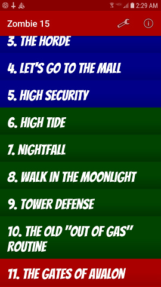
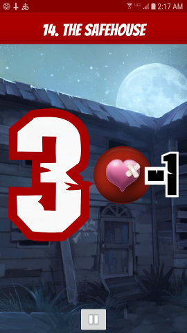
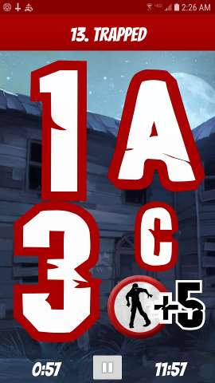
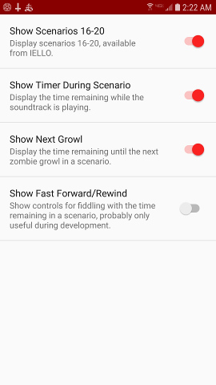

# Zombie 15

This is a support app for IELLO's **Zombie 15'** boardgame; it plays the
soundtrack and manages the Zombie Deck, so that's one thing you don't
have to prepare before playing.

- [Zombie 15' on BoardGameGeek](https://boardgamegeek.com/boardgame/144826)
- [Zombie 15' on IELLO's site](http://www.iellogames.com/Zombie15.html)

This app contains piles of content which belongs to IELLO, and which is used
without permission.

See [CONTRIBUTING](CONTRIBUTING.md) for notes on checking this out &
building it.

## Screen captures

The scenario list:

Here's a running scenario.  When a Zombie card is drawn, letters and
events are only displayed for scenarios which use them:

Scenarios which draw *two* cards per growl are handled too.  This also
shows the time remaining until the next growl and the time remaining in
the scenario (which you can turn on & off in Settings).

And here's the Settings screen:

